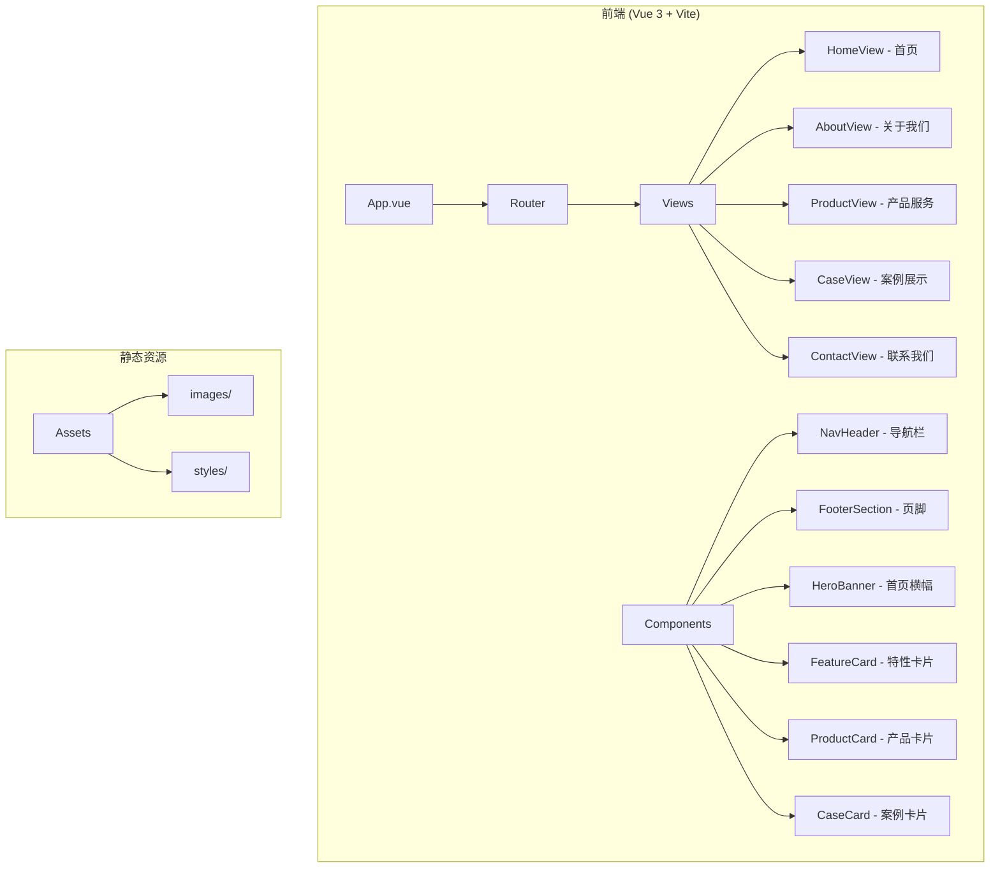
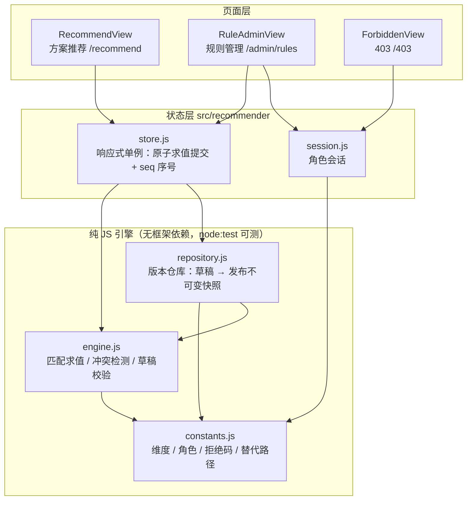

# 广州知运信息技术有限公司官网 - 项目设计文档

## 1. 系统架构



## 2. 页面结构

| 页面 | 路由 | 描述 |
|------|------|------|
| 首页 | `/` | 公司介绍、核心业务、产品亮点 |
| 关于我们 | `/about` | 公司简介、发展历程、企业文化 |
| 产品服务 | `/products` | 智慧物流系统产品介绍 |
| 案例展示 | `/cases` | 成功案例展示 |
| 联系我们 | `/contact` | 联系方式、地图、留言表单 |

## 3. UI/UX 规范

### 3.1 色彩体系
| 用途 | 色值 | 说明 |
|------|------|------|
| 主色调 | `#1890ff` | 科技蓝，体现智慧物流 |
| 辅助色 | `#52c41a` | 成功绿，物流畅通 |
| 强调色 | `#fa8c16` | 活力橙，创新活力 |
| 文字主色 | `#303133` | 标题文字 |
| 文字次色 | `#606266` | 正文文字 |
| 文字辅助 | `#909399` | 辅助说明 |
| 背景色 | `#f5f7fa` | 页面背景 |
| 卡片背景 | `#ffffff` | 卡片白色 |

### 3.2 字体规范
- 标题字体：`"PingFang SC", "Microsoft YaHei", sans-serif`
- 正文字体：`"PingFang SC", "Microsoft YaHei", sans-serif`
- H1: 36px / bold
- H2: 28px / bold
- H3: 22px / semibold
- 正文: 16px / regular
- 辅助: 14px / regular

### 3.3 间距规范
- 页面内边距: 24px
- 卡片内边距: 20px
- 元素间距: 16px
- 小间距: 8px

### 3.4 圆角规范
- 大圆角: 12px (卡片)
- 中圆角: 8px (按钮)
- 小圆角: 4px (输入框)

### 3.5 阴影规范
- 卡片阴影: `0 4px 12px rgba(0, 0, 0, 0.08)`
- 悬浮阴影: `0 8px 24px rgba(0, 0, 0, 0.12)`

## 4. 组件清单

| 组件名 | 功能 | 复用场景 |
|--------|------|----------|
| NavHeader | 顶部导航栏 | 全局 |
| FooterSection | 页脚信息 | 全局 |
| HeroBanner | 首页大图横幅 | 首页 |
| FeatureCard | 特性展示卡片 | 首页、产品页 |
| ProductCard | 产品介绍卡片 | 产品页 |
| CaseCard | 案例展示卡片 | 案例页 |
| SectionTitle | 区块标题 | 全局 |
| ContactForm | 联系表单 | 联系页 |

## 5. 响应式断点

| 断点 | 宽度 | 布局 |
|------|------|------|
| Desktop | ≥1200px | 4列栅格 |
| Tablet | 768px-1199px | 2列栅格 |
| Mobile | <768px | 单列 |

## 6. 方案推荐器设计

### 6.1 模块架构



### 6.2 角色与权限

| 角色 | 标识 | 权限 |
|------|------|------|
| 业务访客 | `visitor` | `recommend:read`（只读推荐结果与匹配依据） |
| 规则管理员 | `rule-admin` | `recommend:read` + `rule:write` + `rule:publish` |
| 未授权用户 | `guest` | 无（仅浏览官网公开页面） |

- 权限校验双层生效：路由守卫（`/admin/rules` → 403）+ 仓库层写操作校验（越权一律返回拒绝对象）
- 角色会话存 `sessionStorage`：刷新保留、关闭标签页失效

### 6.3 规则与版本模型

```
Rule {
  id, name, enabled, priority,          // priority 数值越大越优先
  conditions: {                         // 匹配条件；空数组 = 该维度不限
    businessScale: [],                  // 业务规模 micro/small/medium/large
    warehousing: [],                    // 仓储需求 none/light/standard/automated
    scenario: []                        // 配送场景 b2c/b2b/omnichannel/crossborder
  },
  solution: { code, title, products[], summary, estimatedCycle }
}

Version {                               // 发布后深冻结，不可修改
  version, publishedAt, publishedBy, changelog, rules[]
}
```

### 6.4 求值流程与拒绝分支

```
提交需求
  ├─ 需求为空 ────────────→ 拒绝 EMPTY_REQUIREMENT + 替代路径
  ├─ 无启用规则命中 ──────→ 拒绝 NO_MATCH + 替代路径
  ├─ 最高优先级命中多条不同方案 → 拒绝 RULE_CONFLICT + 替代路径
  └─ 唯一最高优先级命中 ─→ 返回 { result, rationale, version }（原子产出）
```

- 规则冲突定义：两条启用规则**条件重叠 + 优先级相同 + 方案不同**
- 冲突双层拦截：发布时 `validateDraft` 拒绝含冲突草稿；求值时兜底拒绝
- 每类拒绝均携带 `alternatives`（完善需求 / 浏览产品 / 联系顾问 / 切换角色等可执行路径）

### 6.5 一致性保证（结果与依据始终同版本）

1. **原子求值**：`evaluateRequirements` 为纯同步函数，推荐结果、匹配依据、版本号在同一次调用中产自同一不可变版本快照，不存在"结果来自 v1、依据来自 v2"的中间态
2. **单一状态槽**：`store.state.evaluation` 整体替换，UI 只渲染完整的一份求值结果
3. **序号防串扰**：`seq` 单调递增，快速切换场景 / 连续提交时，过期求值结果直接丢弃，只有最后一次求值生效
4. **需求快照**：每次求值的需求在提交时深冻结并随结果保存，页面展示"结果对应的需求快照 + 规则版本"供核对
5. **窗口缩放零重算**：响应式布局纯 CSS 实现，无任何 resize 触发的状态变更
6. **版本不可变**：已发布版本深冻结；发布新版本后，历史求值结果仍归属其求值时的版本

### 6.6 测试

```bash
cd frontend-user && npm test   # node --test，18 个用例
```

| 测试文件 | 覆盖 |
|----------|------|
| `tests/recommender.test.mjs` | 需求判空、正常匹配、优先级裁决、通配条件、停用规则、无匹配拒绝、冲突检测、发布拦截、权限拒绝、版本不可变、跨版本求值归属、持久化往返 |
| `tests/store.test.mjs` | 原子求值提交、快速切换序号防串扰、越权拒绝、冲突草稿发布拦截、发布后历史结果版本不漂移 |
